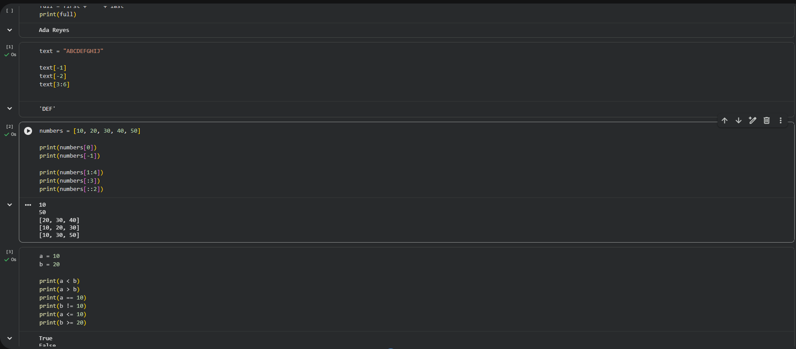

# My Data & AI Journey

## Week 1 
### Learning Journal Entry #1

## *A Little About Me*

Hi, I'm Erika. I work closely with a digital product, but my role is not limited to just one area. I help users when they encounter problems, work directly with clients to understand their needs and experiences, and contribute to the continuous improvement of the product.

I also help with testing and quality assurance, provide feedback on UI/UX, and work with different teams when something needs to be improved, fixed, or enhanced. Because of this, I get to see the product from different perspectives: the user, the client, the support side, and the product side.

That experience has made me increasingly curious about what happens behind the systems I work with, especially the data that connects all of these areas.

## *Why I'm Here*

I joined the Python for Data and AI Bootcamp because I want to become more technical and understand the systems I work with at a deeper level.

Right now, I can identify issues, test features, work with clients, analyze their experiences, and contribute ideas for product improvements. But I also want to understand what happens behind the interface: how data is structured, how information moves through a system, and how that data can be analyzed using Python. 

For me, learning Python is not just about learning how to code. I want to connect technical skills with the experience I already have working with users, clients, products, and data. 

## *What Interests Me About Data and AI* 

What interests me most about Data and AI is how they can connect different pieces of information and turn them into something useful.

In my work, I can sometimes see the problem from several angles. A user might report an issue, a client might describe a different experience, testing might reveal something unexpected, and the product itself may be generating data that tells another part of the story.

I want to learn how data can bring those pieces together. 

Instead of only knowing what happened, I want to eventually understand why it happened, identify patterns, predict what could happen next, and determine what action could help improve the experience. 

That is why diagnostic and predictive analytics (learned tdiagnostic and predictive analytics, which I learned about during our Day 2 discussion, are particularly interesting to me.his from Day 2 discussion) are particularly interesting to me.

## *What I Hope to Build*

By the end of the 20 weeks, I hope to build something practical that connects what I am learning with the kind of work I already do.

I would like to explore how Python and AI can help automate repetitive tasks, especially processes that currently require a lot of manual checking, organizing, or updating of information. I am also interested in learning how data from different databases, tracking systems, and analytics tools can be connected and analyzed more efficiently.

Another area I want to explore is data cleaning and organization, because reliable insights depend on having accurate and consistent data first. From there, I would like to understand how existing reports and dashboards can move beyond simply showing what happened. 

My long-term goal is to explore how connected and well-structured data can support diagnostic analytics, which helps explain why something happened, and eventually predictive analytics, which can help identify patterns, potential issues, or opportunities before they happen. 

Most importantly, I want to learn how to build these kinds of solutions without compromising the accuracy, security, or integrity of the existing data. 

## *What I Learned This Week* 

One of my biggest takeaways from Week 1 is that learning Data and AI starts with strong foundations. I learned how Data Analytics, Data Science, Machine Learning, Deep Learning, and AI are connected, while also building my understanding of Python concepts such as data types, indexing, slicing, and logical operators.

What stood out to me is the importance of understanding the logic behind the code instead of simply memorizing syntax. I also started using GitHub, which helped me see how coding, documentation, and building a portfolio can work together. 

This week also reinforced something familiar to me, whether I am troubleshooting, analyzing data, or writing code, the process starts with understanding the problem, breaking it down, testing solutions, and learning from the results.

**One question I want to explore is: How can I use Python, automation, connected data sources, and analytics to reduce repetitive work and eventually support reliable diagnostic and predictive insights?**

## *AI in Government Digital Services: Connecting Data, Automation, and Insights*

One thing I have noticed when working with digital systems is that a single user issue does not always tell the whole story. The same problem might appear through a support request, client feedback, QA testing, product usage, or analytics. When these sources are viewed separately, important patterns can easily be missed. 

We are also currently in the middle of a platform migration, which has made me think more carefully about how data is structured, transferred, validated, and connected between systems. Week 1 has already helped me understand this process better because I am starting to look at data not just as information to move, but as something that needs to be understood, organized, and protected throughout its lifecycle. 

AI and automation could eventually help connect these different sources of information, reduce repetitive analysis, and identify recurring issues or patterns earlier. However, the results would only be reliable if the underlying data is accurate and properly migrated. Duplicate records, missing information, inconsistent categories, or outdated data could lead to misleading insights.

For me, the goal is not simply to automate tasks. I want to understand how clean, connected, and well-structured data can help reporting move from showing what happened, to understanding **why it happened**, and eventually identifying **what might happen next**, while still supporting human judgment and protecting data integrity.

I am beginning to see how data quality and migration can eventually connect to automation, diagnostic analytics, and predictive analytics. 

